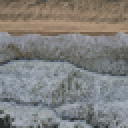
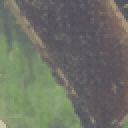
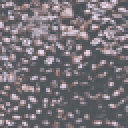
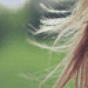
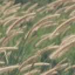
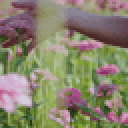

# Lite-Sora

## 简介

lite-sora项目是一个Sora技术复现的项目，它由华东师范大学和ModelScope社区共同发起，探索Sora背后的视频生成技术的最小复现和简洁实现，我们希望可以提供简洁易读的代码方便大家一起改进实验，不断探索提升开源视频生成技术的上限。

## 技术路线

* [x] 搭建基础架构
  * [ ] 模型
    * [x] Text Encoder（基于 Stable Diffusion XL 中的 [Text Encoder](https://huggingface.co/stabilityai/stable-diffusion-xl-base-1.0/blob/main/text_encoder_2/model.safetensors)）
    * [x] VideoDiT（基于 [Facebook DiT](https://github.com/facebookresearch/DiT)）
    * [ ] VideoVAE
  * [x] Scheduler（基于 [DDIM](https://arxiv.org/abs/2010.02502)）
  * [x] Trainer（基于 [PyTorch-lightning](https://lightning.ai/docs/pytorch/stable/)）
* [x] 小规模数据集验证
  * [x] [Pixabay100](https://github.com/ECNU-CILAB/Pixabay100)
* [ ] 在大规模数据集上训练 Video Encoder & Decoder
* [ ] 在大规模数据集上训练 VideoDiT

## 使用

### Python 环境搭建

```
conda env create -f environment.yml
conda activate litesora
```

### 下载模型

* `models/text_encoder/model.safetensors`: 来自 Stable Diffusion XL 的 Text Encoder，[下载链接](https://huggingface.co/stabilityai/stable-diffusion-xl-base-1.0/resolve/main/text_encoder_2/model.safetensors)
* `models/denoising_model/model.safetensors`：我们在 [Pixabay100](https://github.com/ECNU-CILAB/Pixabay100) 数据集上训练的模型，该模型可以证明我们的训练代码能够正常拟合训练数据，分辨率为 64*64。**这个模型显然是过拟合的，由于训练数据少，尚不具备泛化能力，仅用于验证训练算法的正确性。** [下载链接](https://huggingface.co/ECNU-CILab/lite-sora-v1-pixabay100/resolve/main/denoising_model/model.safetensors)
* `models/vae/model.safetensors`: Stable Video Diffusion 的 VAE. [下载链接](https://huggingface.co/stabilityai/stable-video-diffusion-img2vid-xt/resolve/main/vae/diffusion_pytorch_model.fp16.safetensors)

### 训练

```python
from litesora.data import TextVideoDataset
from litesora.models import SDXLTextEncoder2
from litesora.trainers.v1 import LightningVideoDiT
import lightning as pl
import torch


if __name__ == '__main__':
    # dataset and data loader
    dataset = TextVideoDataset("data/pixabay100", "data/pixabay100/metadata.json",
                               num_frames=64, height=64, width=64)
    train_loader = torch.utils.data.DataLoader(dataset, shuffle=True, batch_size=1, num_workers=8)

    # model
    model = LightningVideoDiT(learning_rate=1e-5)
    model.text_encoder.load_state_dict_from_diffusers("models/text_encoder/model.safetensors")

    # train
    trainer = pl.Trainer(max_epochs=100000, accelerator="gpu", devices="auto", callbacks=[
        pl.pytorch.callbacks.ModelCheckpoint(save_top_k=-1)
    ])
    trainer.fit(model=model, train_dataloaders=train_loader)
```

训练程序启动后，可开启 `tensorboard` 监视训练进度

```
tensorboard --logdir .
```

### 推理

* 在像素空间生成一个视频。

```python
from litesora.models import SDXLTextEncoder2, VideoDiT
from litesora.pipelines import PixelVideoDiTPipeline
from litesora.data import save_video
import torch


# models
text_encoder = SDXLTextEncoder2.from_diffusers("models/text_encoder/model.safetensors")
denoising_model = VideoDiT.from_pretrained("models/denoising_model/model.safetensors")

# pipeline
pipe = PixelVideoDiTPipeline(torch_dtype=torch.float16, device="cuda")
pipe.fetch_models(text_encoder, denoising_model)

# generate a video
prompt = "woman, flowers, plants, field, garden"
video = pipe(prompt=prompt, num_inference_steps=100)

# save the video (the resolution is 64*64, we enlarge it to 512*512 here)
save_video(video, "output.mp4", upscale=8)
```

* 把一个视频从像素空间编码到隐空间，然后解码它

```python
from litesora.models import SDVAEEncoder, SVDVAEDecoder
from litesora.data import load_video, tensor2video, concat_video, save_video
import torch
from tqdm import tqdm


frames = load_video("data/pixabay100/videos/168572 (Original).mp4",
                    num_frames=1024, height=1024, width=1024, random_crop=False)
frames = frames.to(dtype=torch.float16, device="cpu")

encoder = SDVAEEncoder.from_diffusers("models/vae/model.safetensors").to(dtype=torch.float16, device="cuda")
decoder = SVDVAEDecoder.from_diffusers("models/vae/model.safetensors").to(dtype=torch.float16, device="cuda")

with torch.no_grad():
    print(frames.shape)
    latents = encoder.encode_video(frames, progress_bar=tqdm)
    print(latents.shape)
    decoded_frames = decoder.decode_video(latents, progress_bar=tqdm)

video = tensor2video(concat_video([frames, decoded_frames]))
save_video(video, "video.mp4", fps=24)
```

### 现阶段效果展示

我们在 [Pixabay100](https://github.com/ECNU-CILAB/Pixabay100) 数据集上训练的模型，该模型可以证明我们的训练代码能够正常拟合训练数据，分辨率为 64*64。**这个模型显然是过拟合的，由于训练数据少，尚不具备泛化能力，仅用于验证训练算法的正确性。** [下载链接](https://huggingface.co/ECNU-CILab/lite-sora-v1-pixabay100/resolve/main/denoising_model/model.safetensors)

|airport, people, crowd, busy|beach, ocean, waves, water, sand|bee, honey, insect, beehive, nature|coffee, beans, caffeine, coffee, shop|
|-|-|-|-|
|||||
|fish, underwater, aquarium, swim|forest, woods, mystical, morning|ocean, beach, sunset, sea, atmosphere|hair, wind, girl, woman, people|
|||||
|reeds, grass, wind, golden, sunshine|sea, ocean, seagulls, birds, sunset|woman, flowers, plants, field, garden|wood, anemones, wildflower, flower|
|||||

我们采用 [Stable-Video-Diffusion](https://huggingface.co/stabilityai/stable-video-diffusion-img2vid-xt) 中的 VAE 模型来做视频的编码和解码。我们的代码支持非常长的高分辨率视频！

https://github.com/modelscope/lite-sora/assets/35051019/dc205719-d0bc-4bca-b117-ff5aa19ebd86
